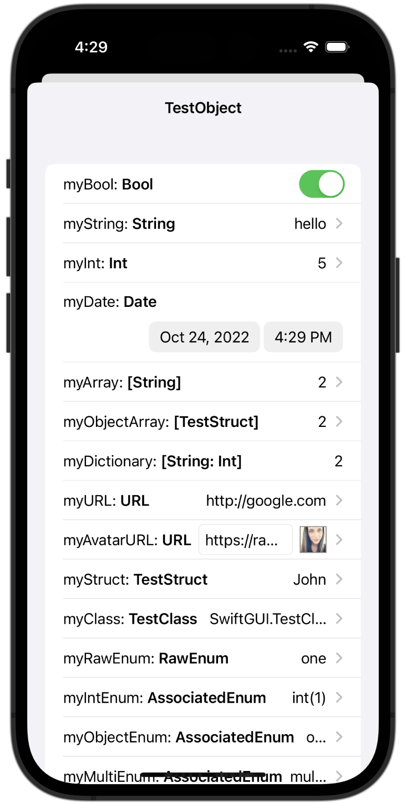

# SwiftGUI

A SwiftUI GUI for browsing and editing pure Swift objects. It's useful as a debug tool, especially in single state apps as you can browse and edit your whole app state.

It supports Swift structs, classes, and enums with associated types.

## Development
Note that this project is still in development. It is missing features, and could be unstable.
